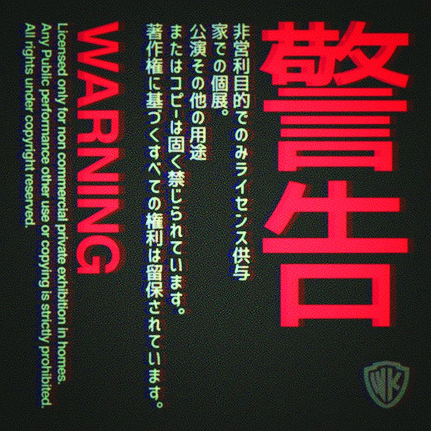
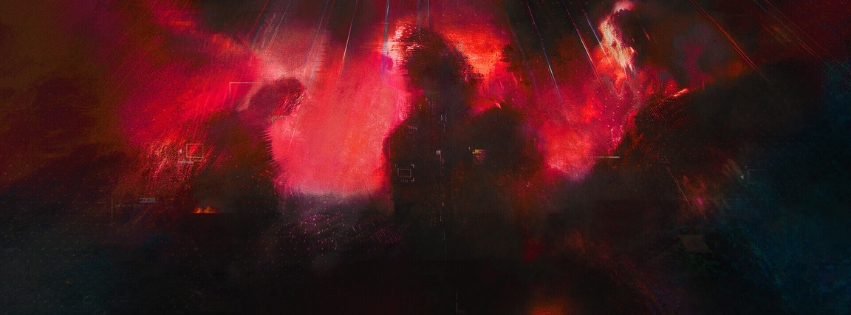

<h3 align="left">Sobre mim!</h3>

#

Meu nome é **Breno Prado**, tenho 24 anos e sou natural de Salvador, Bahia. Atualmente, curso Análise e Desenvolvimento de Sistemas na Universidade Católica do Salvador (UCSAL) e possuo formação técnica em Desenvolvimento de Sistemas pelo SENAI.

Sempre fui apaixonado por tecnologia. Desde pequeno, consumia conteúdos do gênero que me faziam querer me jogar de cabeça na área, impulsionado por obras que me serviram de inspiração como *Akira, Ghost in the Shell, The Matrix* e *Neuromancer* — este último me fez, de verdade, querer ser um cowboy do ciberespaço.
Logo abaixo você pode dar uma olhada nos meus projetos. Espero que se divirta explorando tanto quanto eu me diverti criando cada um deles!

#

 

<h3 align="left">GitHub Stats</h3>

  

  

 

<h3 align="left">Connect with me!</h3>

